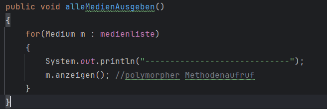

# Tagebuch
## Modul 1:

Alle Videos des Moduls angeschaut und Code interpretiert.

### Was habe ich im Rahmen der Lernaufgabe gelernt?

Ich verstehe jetzt, wie ein polymorpher Methodenaufruf funktioniert.

Polymorpher Methodenaufruf.

m.anzeigen(); ist ein polymorpher Methodenaufruf da m entweder
ein VHS oder ein Cartridge sein kann, weil beide Klassen von
Medium erben. Ob es VHS oder Cartridge ist wird erst während der 
Laufzeit bestimmt.

## Modul 2

Modul 2 wird hier mitaufgenommen, da in diesem Modul nur Videos sind.

### Video 1 - Vererbung:

Video 1 - Vererbung angesehen und verstanden.
Ich verstehe jetzt besser wie Vererbung funktioniert.

### Video 2 - Polymorphie:

Video 2 - Polymorphie. In diesem Video wurde
vertiefend nochmal über Polymorphie gesprochen.
Es wurde der Unterschied zwischen statischen und
dynamischen Typen erklärt.
Es wurde der Zugangsmodifikator protected näher erklärt
und vieles mehr.

### Video 3 - Zentrale Konzepte

Video 3 - Zentrale Konzepte angesehen und verstanden.
Im Video wurden die Themen Vererbung, Überschreiben von
Methoden, Ersetzbarkeit und Dynamische Bindung nochmals erklärt.